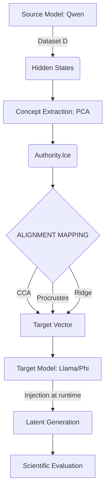

# M8-C: Universal Latent Abstraction Validation Protocol

This document establishes the frozen scientific protocol for evaluating the cross-model transferability of Latent Concepts.

## 1. Hypothesis

**H0 (Null Hypothesis)**: Latent Concepts are strictly model-specific. The transfer of a concept vector between disparate model architectures does not preserve causal behavioral effects. Any geometric alignment is mathematical coincidence without semantic grounding.

**H1 (Alternative Hypothesis)**: There exist transferable latent structures between different models that preserve, at least partially, the causal behavioral effect. Latent Concepts represent a shared semantic abstraction layer.

*We do not assume H1 is true. The protocol is designed to falsify H1 rigorously.*

---

## 2. Experimental Matrix (Models & Concepts)

**Source Model**:
- Qwen2.5-1.5B

**Target Models**:
- Llama-3.2-1B
- Phi-3.5-mini

**Concepts to Evaluate**:
- `Authority`
- `Planning`
- `Helpfulness`
- `Uncertainty`

**Evaluated Pairs**:
- Qwen Authority → Llama Authority space
- Qwen Authority → Phi Authority space
- (Repeated for all concepts and targets)

---

## 3. Dataset Alignment

A unified calibration dataset `D` is mandatory to compute mappings.

**Dataset Composition (`D`)**:
- 25% Neutral Prompts
- 25% Decision-Making Prompts (Targeting Authority)
- 25% Planning & Reasoning Prompts (Targeting Planning)
- 25% Epistemic Uncertainty Prompts (Targeting Uncertainty)

**Procedure**:
1. Run `D` through all models (Source and Targets).
2. Extract and freeze exactly `N` hidden states from the target layers.
3. Save as:
   - `hidden_states_source.npy`
   - `hidden_states_target.npy`
4. Use these aligned states to compute CCA, Procrustes, and Ridge mapping matrices.

---

## 4. Transfer Pipeline

The execution flow for the experiment:



---

## 5. Evaluation Metrics & Statistical Definition

Every metric must report a **mean**, **confidence interval**, and **bootstrap variance** (e.g., `causal_effect: 0.72 ± 0.08`).

### Geometric Transfer (G)
- **Cosine Similarity**: Between mapped source vector and native target vector.
- **Principal Angle**: Between affine subspaces.
- **Manifold Overlap**: Volumetric intersection.
- **Output**: `G_score` (0.0 to 1.0) ± variance.

### Causal Transfer (C) - The Critical Metric
- **Behavioral Shift**: Does output text change consistently?
- **Effect Size**: Magnitude of shift vs control.
- **Direction Preservation**: E.g., Authority MUST increase decisiveness and MUST NOT increase hallucination.
- **Output**: `C_score` (0.0 to 1.0) ± variance.

### Semantic Transfer (S)
- **LLM-as-a-Judge**: Meaning and stylistic alignment.
- **Human Preference Proxy**: Automated scoring.
- **Output**: `S_score` (0.0 to 1.0) ± variance.

### Final Transfer Score (T)
`T = G * C * S`
If any component is near zero, transfer fails. 

---

## 6. Baselines & Controls

Positive results must beat these baselines:

### Baseline A: Native Concept
- Extract Authority directly from Qwen, inject into Qwen.
- Extract Authority directly from Llama, inject into Llama.
- Compare the Transferred Llama Vector against the Native Llama Vector. Transferred must approach Native behavior.

### Baseline B: Random Projection
- Create a random mapping with the same norm.
- Expected: No coherent causal effect.

### Baseline C: Wrong Concept Transfer
- Qwen Authority → Target Uncertainty.
- Expected: Zero increase in Authority metrics.

---

## 7. Transfer Levels & Final Interpretation

The system automatically categorizes the result based on the Transfer Score `T` and its components:

- **MODEL_SPECIFIC**: 
  - `T < threshold`. LCE is highly effective local control but not portable.
- **FALSE_ALIGNMENT**: 
  - `G` is high, but `C` is near zero. CCA found a mathematical correlation that lacks behavioral meaning.
- **PARTIAL_TRANSFER**: 
  - `T` indicates shared behavioral structure, but idiosyncrasies cause degradation compared to the Native Concept baseline.
- **UNIVERSAL_BEHAVIORAL_ABSTRACTION**: 
  - High `G`, high `C`, high `S`. Same geometry, effect, and semantics across completely different model architectures.

---

## 8. Ablation Tests

### 1. Random Vector Test
Inject a random vector of the same norm.
*Expected Result*: No stable semantic direction, high variance across runs, low causal consistency. (Not necessarily gibberish).

### 2. Wrong Concept Test
Must produce causal mismatch.

### 3. Layer Ablation
Sweep early, middle, late layers to map topological transferability.

### 4. Magnitude Sweep
Sweep `[0.25, 0.5, 1.0, 1.5, 2.0]` to find the saturation limit.

---

## 9. Real Execution Mode & Final Outputs

Execution: `python run_m8_c_real.py`

Directory Output Structure:
```
runs/m8_c/
├── raw/
│   ├── hidden_states/
│   └── mappings/
├── metrics/
│   ├── geometry.json
│   ├── causal.json
│   └── semantic.json
├── ablations/
├── reports/
└── final_verdict.json
```
No manual interpretation. The mathematical output of `final_verdict.json` constitutes the final scientific outcome.
